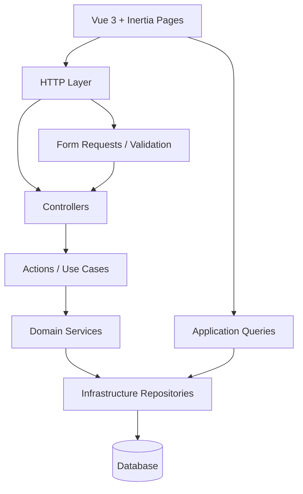

# BookingCore – Laravel Booking Engine

A modern **booking engine built with Laravel 12, Vue 3 and Inertia.js**,
designed with a strong focus on **clean architecture, domain separation,
and testability**.

This repository demonstrates how a booking system can be implemented
using a structured **Domain-Driven Design (DDD) inspired architecture** rather
than traditional CRUD‑oriented Laravel controllers.

The project includes both:

- Backend domain architecture\
- Modern Vue + Inertia UI

The goal is to showcase patterns suitable for scalable production
systems.

------------------------------------------------------------------------

# Features

### Booking Engine

-   Resource‑based booking system
-   Activities assigned to resources
-   Working hours support
-   Time‑off periods
-   Activity buffers (before / after)
-   Automatic slot generation
-   Booking conflict detection
-   Booking cancellation
-   Booking status updates

### API Layer

-   Clean API endpoints
-   Centralized exception handling
-   Validation layer
-   Consistent JSON responses

### Frontend (Vue + Inertia)

-   Vue 3 Composition API
-   Inertia.js SPA navigation
-   Reactive booking form
-   Dynamic option loading
-   Slot availability UI
-   Status badges
-   Booking action buttons

### Architecture

-   Domain‑driven folder structure
-   Thin controllers
-   DTO objects
-   Domain services
-   Repositories
-   Centralized exception mapping
-   Query objects
-   Infrastructure layer

### Testing

-   Pest test suite
-   Unit tests for domain logic
-   Feature tests for API flows

------------------------------------------------------------------------

# Architecture

The project follows a layered architecture inspired by Domain‑Driven
Design and Clean Architecture.

HTTP Layer\
↓\
Requests / Validation\
↓\
Actions (Use Cases)\
↓\
Domain Services\
↓\
Repositories\
↓\
Database

### Key principles:

- Thin controllers
- Domain logic in services
- DTOs between layers
- Query objects for reads
- Repository abstraction
- Centralized exception handling

------------------------------------------------------------------------

# Architecture Diagram

The project separates write flows and read flows into dedicated layers.

- **Write flow** goes through validation, controllers, actions, and domain services
- **Read flow** is handled by application queries
- **Persistence** is isolated in the infrastructure layer
- **Frontend** is built with Vue 3 and Inertia.js

------------------------------------------------------------------------

# Project Structure

    app
    ├ Domain
    │  └ Booking
    │     ├ Actions
    │     ├ DTO
    │     ├ Exceptions
    │     ├ Services
    │     └ Support
    │
    ├ Application
    │  └ Booking
    │     └ Queries
    │
    ├ Infrastructure
    │  └ Booking
    │     └ Repositories
    │
    ├ Http
    │  ├ Controllers
    │  │  └ Api
    │  │     └ Booking
    │  └ Requests
    │
    resources/js
    ├ Pages
    │  └ Booking
    │     ├ Index.vue
    │     └ Create.vue
    │
    ├ Components
    │  └ Booking
    │     ├ BookingTable.vue
    │     ├ BookingStatusBadge.vue
    │     ├ BookingActions.vue
    │     └ BookingForm.vue
    │
    └ Composables
       └ Booking
          └ useBookingForm.js

------------------------------------------------------------------------

# Booking Lifecycle

pending → confirmed → completed\
↘\
cancelled

### Rules:

- Cancelled bookings cannot be modified
- Status cannot be set to the same value
- Cancellation must use the cancel endpoint

------------------------------------------------------------------------

# API Endpoints

### Create Booking

POST `/api/bookings/create`

### Cancel Booking

POST `/api/bookings/{booking}/cancel`

### Update Booking Status

PATCH `/api/bookings/{booking}/status`

------------------------------------------------------------------------

# Frontend Architecture

The UI is built using:

-   Vue 3 Composition API
-   Inertia.js
-   TailwindCSS

Composable example:

    useBookingForm()

### Handles:

- reactive form state
- loading resources
- loading activities
- loading slots
- booking submission

------------------------------------------------------------------------

# Testing

Tests are written using Pest.

Run tests:

    php artisan test

------------------------------------------------------------------------

# Technologies

### Backend

- Laravel 12
- PHP 8.3
- Eloquent ORM
- Carbon
- Pest

### Frontend

- Vue 3
- Inertia.js
- TailwindCSS

### Infrastructure

- SQLite (testing)
- MySQL / PostgreSQL compatible

------------------------------------------------------------------------

# Installation

Clone the repository:

git clone https://github.com/yourname/bookingcore.git

Install dependencies:

composer install
npm install

Run migrations:

php artisan migrate

Start the development server:

php artisan serve
npm run dev

------------------------------------------------------------------------

# Design Goals

This project demonstrates:

-   scalable Laravel architecture
-   clean domain separation
-   test‑driven backend development
-   modern Laravel + Vue integration

------------------------------------------------------------------------

# Author

Roman Kocián
Laravel Backend Developer

BookingCore
Architecture project

olaao
http://olaao.com
SaaS platform