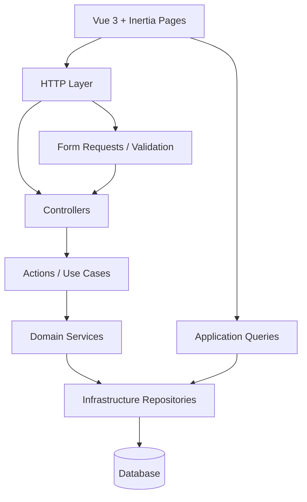

# BookingCore


**BookingCore** is a free open-source booking system for small service businesses.

It is designed for salons, spas, massage therapists, consultants, coaches, freelancers, and other appointment-based businesses that need a simple way to accept bookings online and sync reservations with the owner’s calendar.

Website: **https://bookingcore.link**

---

## Why BookingCore?

Many small service businesses do not need a complex scheduling platform.

They often need something much simpler:

- a public booking page,
- service and availability setup,
- calendar-based reservation management,
- fewer admin tasks,
- and a system they can understand, self-host, and extend.

BookingCore focuses on a lightweight booking flow where customers book online and reservations sync directly with the owner’s calendar.

The goal is not to replace existing calendars, but to add a simple booking layer on top of them.

---

## Current status

BookingCore currently supports Google Calendar integration as the first calendar provider.

Future roadmap includes support for additional calendar providers such as:

- Apple Calendar
- Microsoft Outlook Calendar
- more calendar and scheduling integrations

---

## Features

### Booking system

- Public booking pages
- Branch / unit based booking structure
- Activities assigned to units
- Working hours
- Time-off periods
- Activity duration and buffers
- Automatic time slot generation
- Booking conflict detection
- Booking cancellation
- Booking status updates
- Calendar-first workflow

### Calendar workflow

- Connect a calendar provider
- Sync reservations with the owner’s calendar
- Reduce the need to manage another admin dashboard
- Keep bookings close to the tools business owners already use

### Business use cases

BookingCore is suitable for:

- beauty salons
- hairdressers
- massage therapists
- wellness and spa services
- consultants
- coaches
- freelancers
- appointment-based local businesses

---

## Tech stack

### Backend

- Laravel 12
- PHP 8.4
- Eloquent ORM
- MySQL / MariaDB
- Pest

### Frontend

- Vue 3
- Inertia.js
- Tailwind CSS

### Infrastructure

- Docker
- Queue worker
- Scheduler
- Calendar provider integration

---

## Architecture

BookingCore is built with a clean backend structure inspired by Domain-Driven Design and Clean Architecture.

The goal is to keep the project maintainable, testable, and easy to extend.

```text
HTTP Layer
↓
Requests / Validation
↓
Actions / Use Cases
↓
Domain Services
↓
Repositories
↓
Database
```

### Key principles

- Thin controllers
- Domain logic in services
- DTOs between layers
- Query objects for read flows
- Repository abstraction
- Centralized exception handling
- Infrastructure separated from domain logic

---

## Architecture diagram



---

## Project structure

```text
app
├── Domain
│   └── Booking
│       ├── Actions
│       ├── DTO
│       ├── Exceptions
│       ├── Services
│       └── Support
│
├── Application
│   └── Booking
│       └── Queries
│
├── Infrastructure
│   └── Booking
│       └── Repositories
│
├── Http
│   ├── Controllers
│   │   └── Api
│   │       └── Booking
│   └── Requests
│
resources/js
├── Pages
│   └── Booking
├── Components
│   └── Booking
└── Composables
    └── Booking
```

---

## Booking lifecycle

```text
pending → confirmed → completed
       ↘
        cancelled
```

### Rules

- Cancelled bookings cannot be modified
- Status cannot be set to the same value
- Cancellation must use the cancellation flow
- Conflicting bookings are prevented by domain rules

---

## API endpoints

### Create booking

```http
POST /api/bookings/create
```

### Cancel booking

```http
POST /api/bookings/{booking}/cancel
```

### Update booking status

```http
PATCH /api/bookings/{booking}/status
```

---

## Installation

Clone the repository:

```bash
git clone https://github.com/er-ko/bookingcore.git
cd bookingcore
```

Install PHP dependencies:

```bash
composer install
```

Install frontend dependencies:

```bash
npm install
```

Copy the environment file:

```bash
cp .env.example .env
```

Generate the application key:

```bash
php artisan key:generate
```

Run migrations:

```bash
php artisan migrate
```

Start the development server:

```bash
php artisan serve
npm run dev
```

Run tests:

```bash
php artisan test
```

---

## Roadmap

Planned improvements:

- Apple Calendar integration
- Microsoft Outlook Calendar integration
- More calendar providers
- Improved public booking pages
- More flexible availability rules
- Better self-hosting documentation
- More installation examples
- Docker production setup guide
- Additional tests and example data

---

## Contributing

Contributions are welcome.

You can help by:

- reporting bugs,
- improving documentation,
- suggesting features,
- adding tests,
- improving calendar integrations,
- or submitting pull requests.

---

## License

BookingCore is open-source software.

Please check the repository license file for details.

---

## Author

**Roman Kocián**  
PHP/Laravel Backend Developer  
Founder of Olaao.com and BookingCore.link

- Olaao: https://olaao.com
- BookingCore: https://bookingcore.link
